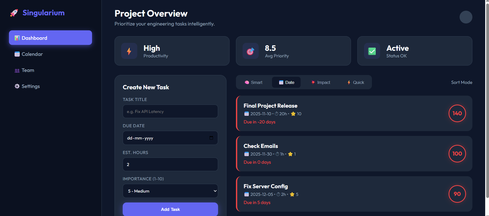
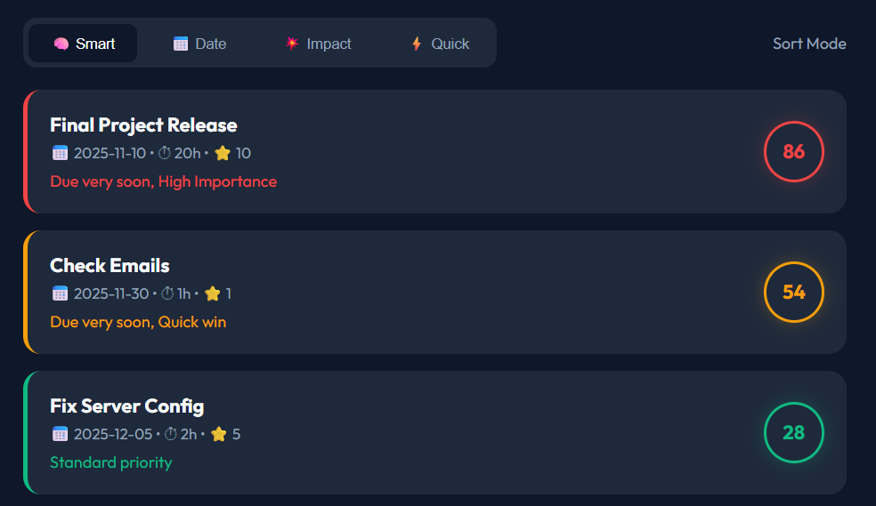
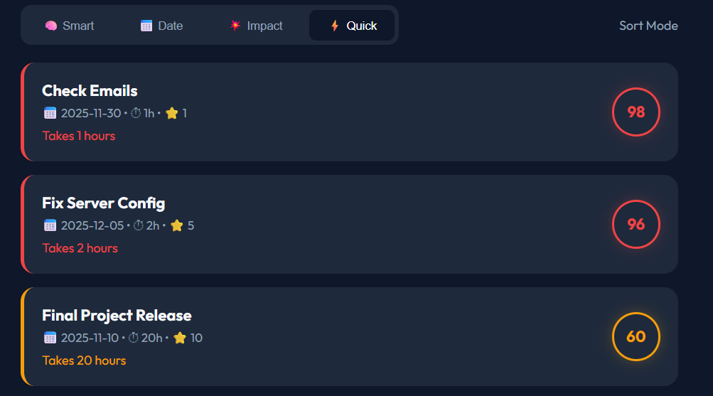
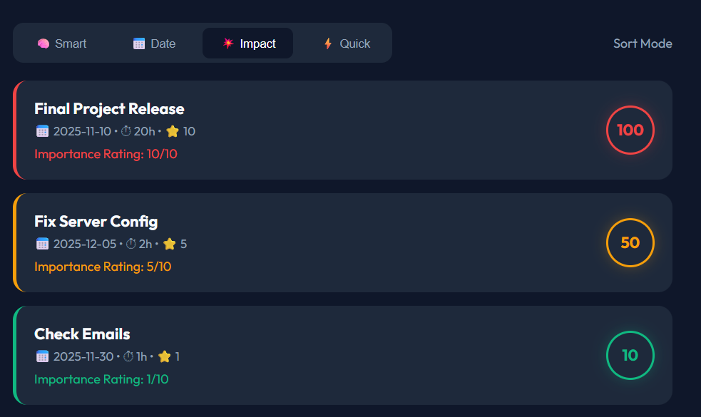
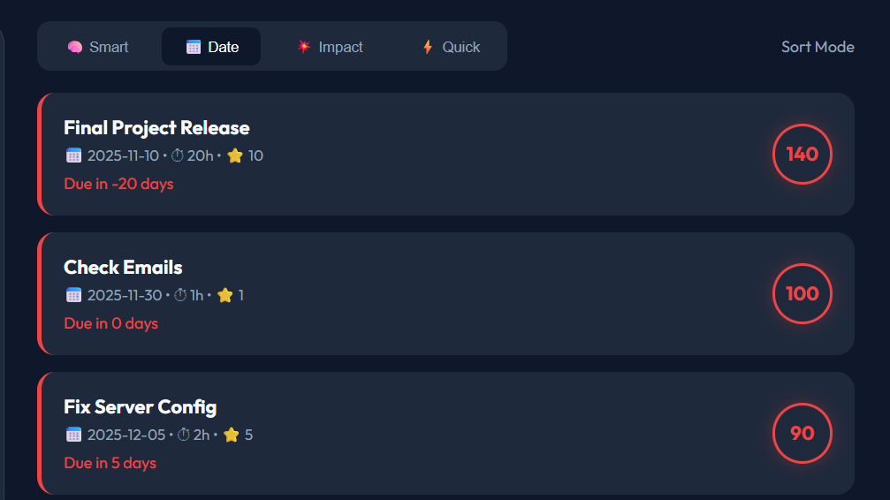

# 🚀 Singularium — Smart Task Analyzer

<div align="center">


**An intelligent task prioritization engine with a SaaS-style dark-mode dashboard.**

*Solves "Task Paralysis" using a custom Weighted Decay Algorithm — not just a to-do list.*

</div>

---

## 📸 Screenshots

### 🏠 Main Dashboard


### 🧠 Smart Strategy Selection


### ⚡ Quick Session Mode


### 💥 Impact Analysis


### 📅 Date-Based Sorting


---

## ✨ Features

| Feature | Description |
|---|---|
| 🧠 **Smart Scoring Engine** | Custom algorithm scores every task 0–100 using 4 weighted vectors |
| 🕸️ **Dependency Gravity** | Tasks blocking other important tasks are automatically promoted |
| 📉 **Urgency Decay Curve** | Hyperbolic decay — tasks due tomorrow score 10× higher than next week |
| ⚡ **Quick Wins Mode** | Promotes short tasks to keep momentum going |
| 📊 **4 Sort Strategies** | Switch between Smart, Deadline, Impact, and Quick Wins instantly |
| 🔐 **JWT Authentication** | Secure user register/login with token-based auth |
| 🎨 **Dark SaaS Dashboard** | Sleek split-panel UI with color-coded priority indicators |
| 🛡️ **Circular Dependency Guard** | Model-level validation prevents A→B→A dependency loops |

---

## 🧠 Algorithm — The "Secret Sauce"

The core of this project is the [`SmartScoringEngine`](./tasks/engine.py) class. It calculates a **Priority Score** using a weighted multi-vector formula:

$$Score = Urgency + (Importance \times 3.5) + EffortBonus + DependencyGravity$$

### 1. ⏰ Urgency — Hyperbolic Decay
```
urgency = 30 / (days_until_due + 1)
```
- Tasks due **tomorrow** score exponentially higher than tasks due next week
- **Overdue tasks** skip the curve and get a static Critical penalty of **50 pts**

### 2. ⭐ Strategic Importance
```
importance_score = importance_rating × 3.5
```
- Rated 1–10 by the user, multiplied by 3.5
- Ensures high-importance strategic work always outweighs low-value busy work

### 3. ⚡ Effort Bonus (Quick Wins)
```
effort_bonus = 10 / max(estimated_hours, 1)
```
- Short tasks (< 2 hours) receive a micro-bonus
- Encourages clearing small blockers first to build momentum

### 4. 🕸️ Dependency Gravity
```
dep_bonus = number_of_tasks_blocked × 5
```
- If your task blocks 3 other tasks, it gets +15 pts automatically
- Ensures bottlenecks are cleared first, even if the task itself seems unimportant

---

## 📊 Prioritization Strategies

Switch between strategies in the dashboard in real time:

| Strategy | Logic | Best For |
|---|---|---|
| 🧠 **Smart Balance** | Full algorithm (all 4 vectors) | Daily use — the recommended default |
| 📅 **Deadline** | `100 - (days × 2)` — closest due date wins | When you have hard deadlines |
| 💥 **Impact** | `importance × 10` — highest rated task wins | Strategic planning sessions |
| ⚡ **Quick Wins** | `100 - (hours × 2)` — shortest task wins | Busy days, need to feel progress |

---

## 🏗️ Tech Stack

| Layer | Technology |
|---|---|
| **Backend** | Python 3.8+, Django 4.0+ |
| **REST API** | Django REST Framework |
| **Authentication** | JWT via `djangorestframework-simplejwt` |
| **Database** | SQLite (default), swappable via Django settings |
| **CORS** | `django-cors-headers` |
| **Frontend** | Vanilla HTML5, CSS3 (CSS Variables), JavaScript ES6 (Fetch API) |

---

## 📁 Project Structure

```
smart-task-analyzer/
│
├── backend/                  # Django project configuration
│   ├── settings.py           # Project settings
│   ├── urls.py               # Root URL routing
│   └── wsgi.py
│
├── tasks/                    # Core app
│   ├── engine.py             # 🧠 SmartScoringEngine — the algorithm
│   ├── models.py             # Task model with self-referencing dependency graph
│   ├── views.py              # REST API views (create & analyze)
│   ├── auth_views.py         # JWT register/login endpoints
│   ├── serializers.py        # DRF serializers
│   └── urls.py               # App-level URL routing
│
├── frontend/                 # Static frontend (no build step needed)
│   ├── index.html            # Dashboard UI
│   ├── main.js               # Fetch API calls + dynamic rendering
│   └── style.css             # Dark mode SaaS styling with CSS Variables
│
├── Images/                   # UI screenshots
├── manage.py
├── requirements.txt
└── .gitignore
```

---

## 🔌 API Endpoints

Base URL: `http://127.0.0.1:8000/api/`

| Method | Endpoint | Description | Body |
|---|---|---|---|
| `POST` | `/tasks/create/` | Create a new task | `title, due_date, importance, estimated_hours, dependencies` |
| `POST` | `/tasks/analyze/` | Analyze & rank all tasks | `strategy` (`smart_balance` / `deadline` / `impact` / `quick_wins`) |
| `POST` | `/auth/register/` | Register a new user | `username, password, email` |
| `POST` | `/auth/login/` | Login and get JWT tokens | `username, password` |

### Example: Analyze Tasks
```bash
curl -X POST http://127.0.0.1:8000/api/tasks/analyze/ \
  -H "Content-Type: application/json" \
  -d '{"strategy": "smart_balance"}'
```

### Example Response
```json
[
  {
    "id": 3,
    "title": "Fix API Latency",
    "due_date": "2024-01-15",
    "importance": 9,
    "estimated_hours": 2,
    "score": 47.5,
    "explanation": "Due very soon, High Importance, Blocks 2 tasks"
  }
]
```

---

## 🛠️ Setup & Installation

### Prerequisites
- Python 3.8+
- pip

### 1. Clone the Repository
```bash
git clone https://github.com/YOUR_USERNAME/smart-task-analyzer.git
cd smart-task-analyzer
```

### 2. Create a Virtual Environment (Recommended)
```bash
python -m venv venv
source venv/bin/activate      # macOS/Linux
venv\Scripts\activate         # Windows
```

### 3. Install Dependencies
```bash
pip install -r requirements.txt
```

### 4. Initialize the Database
```bash
python manage.py makemigrations
python manage.py migrate
```

### 5. Run the Backend Server
```bash
python manage.py runserver
```

### 6. Open the Dashboard
Open `frontend/index.html` directly in your browser.

> The frontend talks to `http://127.0.0.1:8000` — make sure Django is running first.

---

## 🧪 Running Tests

Run the automated unit tests to verify the scoring algorithm:
```bash
python manage.py test tasks
```

---

## 🏛️ Design Decisions

- **Separation of Concerns** — Scoring logic is fully isolated in `tasks/engine.py`, keeping Views thin and the algorithm independently testable.
- **No Frontend Build Step** — Built with pure HTML/JS/CSS using CSS Variables to mimic a React/Tailwind workflow with zero tooling complexity.
- **Circular Dependency Prevention** — The `Task` model's `clean()` method raises a `ValidationError` if a task is set to depend on itself.
- **Hyperbolic vs Linear Urgency** — Linear day-counting treats day 1 and day 5 as nearly equal. The `30/(days+1)` curve makes urgency feel exponential, which matches real-world psychology.

---

## 📄 License

This project is licensed under the **MIT License** — feel free to use, modify, and distribute.

---

## 👤 Author

**Rakshit**
- GitHub: [@YOUR_USERNAME](https://github.com/YOUR_USERNAME)

---

<div align="center">
⭐ If you found this useful, please give it a star!
</div>